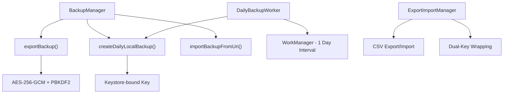
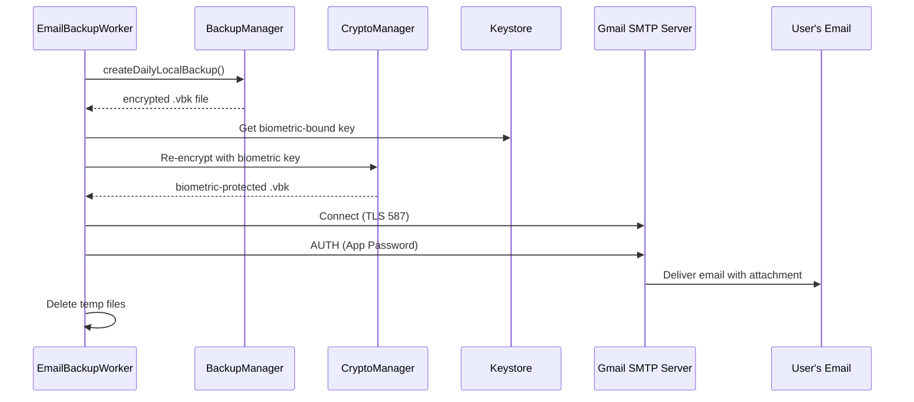
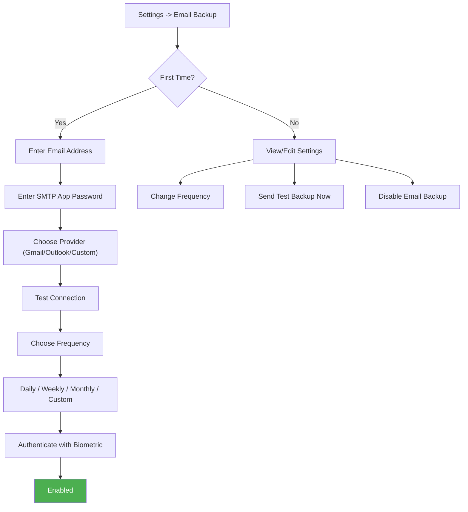
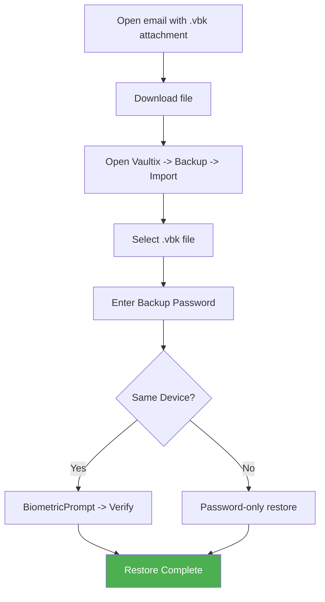

# 📋 Vaultix — دراسة جدوى: وحدة النسخ الاحتياطي عبر البريد الإلكتروني

> **التاريخ:** 8 مايو 2026  
> **النطاق:** إضافة نسخ احتياطي تلقائي مشفر عبر البريد الإلكتروني مع استعادة محمية بالقياسات الحيوية  
> **الأثر:** سيؤدي إلى إضافة صلاحية INTERNET لتطبيق يعمل حاليًا بالكامل دون اتصال

---

## 1. ملخص البنية الحالية

### 1.1 ما هو موجود اليوم



| المكون | الملف | الدور |
|--------|-------|-------|
| `BackupManager` | `BackupManager.kt` | نسخ احتياطي/استعادة كاملة للخزنة (JSON + AES-GCM) |
| `DailyBackupWorker` | `DailyBackupWorker.kt` | عامل WorkManager للنسخ المحلي الدوري |
| `ExportImportManager` | `ExportImportManager.kt` | تصدير CSV مع تغليف ثنائي للمفاتيح |
| `CryptoManager` | `CryptoManager.kt` | نواة التشفير AES-256-GCM |
| `KeystoreManager` | `KeystoreManager.kt` | إدارة مفاتيح Android Keystore |
| `SecurePreferences` | `SecurePreferences.kt` | إعدادات DataStore مشفرة |

### 1.2 ملاحظة أساسية

ملف `AndroidManifest.xml` يصرح بشكل واضح:

```xml
<!-- NO INTERNET PERMISSION - Fully offline app -->
```

هذه هي **هوية أساسية** في Vaultix. إضافة صلاحية INTERNET تعتبر **قرارًا معماريًا مهمًا**.

---

## 2. تحليل المتطلبات

### 2.1 المتطلبات الوظيفية

| # | المتطلب | التفاصيل |
|---|---------|----------|
| FR1 | نسخ احتياطي مجدول عبر البريد | عامل يرسل ملف `.vbk` مشفرًا إلى بريد المستخدم |
| FR2 | جدولة مرنة | يومي / أسبوعي / شهري / فترة مخصصة |
| FR3 | إعداد البريد | المستخدم يزوّد عنوان بريده الإلكتروني |
| FR4 | استعادة محمية حيويًا | لا يمكن استعادة النسخة إلا ببصمة/وجه |
| FR5 | منع الوصول غير المصرح | حتى مع الوصول للبريد، النسخة غير قابلة للاستخدام دون القياسات الحيوية |

### 2.2 المتطلبات غير الوظيفية

| # | المتطلب | الأولوية |
|---|---------|----------|
| NFR1 | أقل تعرض ممكن للإنترنت | 🔴 حرج |
| NFR2 | Zero knowledge دون خوادم خارجية | 🔴 حرج |
| NFR3 | كفاءة البطارية | 🟡 عالية |
| NFR4 | موثوقية العمل في الخلفية | 🟡 عالية |
| NFR5 | الحفاظ على سمعة أمان التطبيق | 🔴 حرج |

---

## 3. النهج التقني

### 3.1 إرسال البريد — JavaMail SMTP (بدون خادم)

> [!IMPORTANT]
> هذا النهج يعتمد على **SMTP مباشر** من الجهاز. لا حاجة لأي خادم Backend. التطبيق يتصل مباشرة بخوادم Gmail/Outlook.



#### كيف يعمل:
1. **المستخدم ينشئ App Password** من حساب Gmail/Outlook (إعداد لمرة واحدة)
2. التطبيق يخزن App Password مشفرًا في `SecurePreferences`
3. العامل يستخدم JavaMail API للإرسال عبر SMTP (مشفر بـ TLS)
4. **لا يوجد خادم Vaultix** ضمن السلسلة — اتصال مباشر من الجهاز إلى SMTP

#### المكتبات: `com.sun.mail:android-mail` + `com.sun.mail:android-activation`
```kotlin
// build.gradle.kts addition
implementation("com.sun.mail:android-mail:1.6.7")
implementation("com.sun.mail:android-activation:1.6.7")
```

### 3.2 تشفير النسخة الاحتياطية بحماية القياسات الحيوية

> [!CAUTION]
> هذا الجزء هو الأكثر تعقيدًا. مفاتيح Android Keystore الحيوية **لا يمكن استخدامها داخل Workers بالخلفية** لأن `setUserAuthenticationRequired(true)` يتطلب `BiometricPrompt` في واجهة أمامية.

#### التحدي:

```
❌ العامل يعمل بالخلفية → لا توجد واجهة → لا يمكن إظهار BiometricPrompt
❌ مفتاح Keystore مع setUserAuthenticationRequired(true) → يرمي UserNotAuthenticatedException
```

#### الحل — معمارية "Biometric Key Wrapping":

```mermaid
graph TD
    subgraph "مرحلة الإعداد (واجهة أمامية مع بصمة)"
        A["المستخدم يفعل النسخ عبر البريد"] --> B["إظهار BiometricPrompt"]
        B --> C["إنشاء مفتاح مربوط بالقياسات الحيوية (Keystore)"]
        C --> D["إنشاء مفتاح عشوائي لتشفير النسخة (BEK)"]
        D --> E["تشفير BEK بمفتاح حيوي -> Wrapped-BEK"]
        E --> F["تخزين Wrapped-BEK في SecurePreferences"]
    end

    subgraph "مرحلة النسخ (خلفية - Worker)"
        G["تشغيل EmailBackupWorker"] --> H["بناء حمولة النسخ (JSON)"]
        H --> I["تشفير بمفتاح Keystore قياسي (غير حيوي)"]
        I --> J["إضافة ترويسة تتطلب بصمة داخل الملف"]
        J --> K["الإرسال عبر SMTP"]
    end

    subgraph "مرحلة الاستعادة (واجهة أمامية مع بصمة)"
        L["المستخدم يستورد .vbk من البريد"] --> M["إظهار BiometricPrompt"]
        M --> N["فك قفل المفتاح الحيوي"]
        N --> O["فك Wrapped-BEK -> BEK"]
        O --> P["فك تشفير ملف النسخة باستخدام BEK"]
        P --> Q["استعادة بيانات الخزنة"]
    end
```



#### كيف تعمل الحماية الحيوية فعليًا:

| المرحلة | السياق | هل القياسات الحيوية مطلوبة؟ | المفتاح المستخدم |
|---------|--------|------------------------------|------------------|
| **الإعداد** | واجهة أمامية | ✅ نعم | مفتاح Keystore حيوي (ينتج Wrapped-BEK) |
| **النسخ** (Worker) | خلفية | ❌ لا | مفتاح Keystore قياسي + اشتقاق BEK |
| **الاستعادة** | واجهة أمامية | ✅ نعم | مفتاح Keystore حيوي (لفك BEK) |

**الملف يُشفّر بمفتاح (BEK) لا يمكن فكّه إلا عبر مفتاح Keystore مربوط بالقياسات الحيوية. وبما أن هذا المفتاح يتطلب `BiometricPrompt`، فالملف عمليًا مقفول ببصمة.**

> [!NOTE]
> مفتاح BEK هو مفتاح AES-256 عشوائي. يتم تغليفه (تشفيره) بمفتاح Keystore عليه `setUserAuthenticationRequired(true)`. هذا يعني:
> - العامل يستطيع إنشاء النسخة (باستخدام BEK في الذاكرة المؤقتة أثناء الإعداد)
> - لكن **الاستعادة** تتطلب مصادقة حيوية لفك BEK
> - أي شخص يملك البريد فقط سيحصل على كتلة AES-256-GCM غير قابلة للاستخدام

### 3.3 معمارية الجدولة

```kotlin
enum class BackupFrequency(val intervalHours: Long) {
    DAILY(24),
    WEEKLY(168),       // 7 * 24
    MONTHLY(720),      // 30 * 24
    CUSTOM(0)          // User-defined
}
```

باستخدام `PeriodicWorkRequest`:
```kotlin
val request = PeriodicWorkRequestBuilder<EmailBackupWorker>(
    intervalHours, TimeUnit.HOURS
)
    .setConstraints(
        Constraints.Builder()
            .setRequiredNetworkType(NetworkType.CONNECTED)  // Needs internet
            .setRequiresBatteryNotLow(true)
            .build()
    )
    .build()
```

---

## 4. خطة التنفيذ على مستوى الملفات

### 4.1 ملفات جديدة يجب إنشاؤها

| # | الملف | الغرض |
|---|-------|-------|
| 1 | `worker/EmailBackupWorker.kt` | عامل WorkManager ينشئ النسخة ويرسل البريد |
| 2 | `util/EmailSender.kt` | أداة إرسال SMTP (تغليف JavaMail) |
| 3 | `security/BiometricBackupKeyManager.kt` | إدارة مفتاح Keystore الحيوي لتشفير النسخة |
| 4 | `ui/screens/EmailBackupSettingsScreen.kt` | واجهة إعداد البريد والجدولة والاختبار |
| 5 | `ui/viewmodel/EmailBackupViewModel.kt` | ViewModel لإعدادات النسخ عبر البريد |
| 6 | `data/model/EmailBackupConfig.kt` | نموذج بيانات إعداد النسخ الاحتياطي |

### 4.2 ملفات يجب تعديلها

| # | الملف | التغييرات |
|---|-------|-----------|
| 1 | `AndroidManifest.xml` | إضافة صلاحيتي `INTERNET` و `ACCESS_NETWORK_STATE` |
| 2 | `build.gradle.kts` | إضافة اعتمادات JavaMail |
| 3 | `KeystoreManager.kt` | إضافة alias لمفتاح حيوي + دالة إنشاء |
| 4 | `SecurePreferences.kt` | مفاتيح إعداد البريد وبيانات SMTP والجدولة |
| 5 | `VaultixApplication.kt` | جدولة `EmailBackupWorker` عند بدء التطبيق |
| 6 | `Screen.kt` | إضافة مسار `EmailBackupSettings` |
| 7 | `BackupManager.kt` | إضافة دالة تصدير نسخة بصيغة `ByteArray` (مرفق البريد) |

---

## 5. نموذج التهديد الأمني

### 5.1 تحليل التهديدات

| التهديد | متجه الهجوم | التخفيف |
|---------|--------------|---------|
| اختراق حساب البريد | المهاجم ينزّل مرفق `.vbk` | الملف مشفر AES-256-GCM ويتطلب مفتاحًا حيويًا على نفس الجهاز |
| تسرب بيانات SMTP | المهاجم يرسل رسائل باسم المستخدم | البيانات مخزنة في `SecurePreferences` (AES-GCM + Keystore) |
| هجوم رجل-في-الوسط | اعتراض الشبكة | SMTP عبر TLS (587/465) والملف أصلًا مشفر |
| تطبيق ضار يقرأ النسخة | تطبيق آخر مع إنترنت | النسخة مشفرة؛ مفتاح Keystore مرتبط بالتطبيق |
| سرقة الجهاز | وصول مادي | القياسات الحيوية مطلوبة للاستعادة + قفل تلقائي |
| الاستعادة على جهاز آخر | المستخدم يحاول الاستعادة على هاتف مختلف | ❌ **غير ممكن** (مفتاح Keystore مرتبط بالجهاز) |

### 5.2 مشكلة الاستعادة عبر الأجهزة

> [!WARNING]
> **قيد حرج:** مفاتيح Android Keystore **مرتبطة بالجهاز**. إذا فُقد الهاتف، **لا يمكن استعادة** النسخة على جهاز جديد بنفس النهج الصارم.

#### حلول ممكنة:

| الخيار | النهج | المفاضلة |
|--------|-------|----------|
| **A. جهاز فقط** | مفتاح حيوي Keystore صرف | 🔒 أمان أقصى، ❌ بدون استعادة عبر الأجهزة |
| **B. كلمة مرور + بصمة** | تشفير بكلمة مرور؛ والبصمة طبقة إضافية عند الاستعادة | ✅ استعادة عبر الأجهزة بكلمة المرور، 🔒 بصمة على نفس الجهاز |
| **C. مفتاح استرداد** | إنشاء مفتاح استرداد يُعرض مرة واحدة | ✅ استعادة عبر الأجهزة، 🟡 يعتمد على حفظ المستخدم للمفتاح |

> [!TIP]
> **الموصى به: الخيار B (كلمة مرور + بصمة)**
> - ملف النسخة يُشفّر بكلمة مرور المستخدم (كما في `exportBackup()` الحالي)
> - على **نفس الجهاز**: الاستعادة تتطلب البصمة كطبقة إضافية
> - على **جهاز جديد**: يمكن الاستعادة بكلمة المرور فقط
> - يحافظ هذا على تدفق `BackupManager` الحالي مع تعزيز أمني إضافي

---

## 6. أثر إضافة صلاحية INTERNET

### 6.1 الحالة الحالية
```xml
<!-- NO INTERNET PERMISSION - Fully offline app -->
```

### 6.2 ما الذي سيتغير

```diff
-<!-- NO INTERNET PERMISSION - Fully offline app -->
+<!-- INTERNET used ONLY for email backup (user-initiated feature) -->
+<uses-permission android:name="android.permission.INTERNET" />
+<uses-permission android:name="android.permission.ACCESS_NETWORK_STATE" />
```

### 6.3 تخفيف المخاطر

| القلق | التخفيف |
|------|---------|
| المستخدمون يخشون تسريب البيانات | الميزة **اختيارية** ومغلقة افتراضيًا |
| أدوات الخصوصية تعتبر التطبيق مريبًا | توثيق واضح: "الإنترنت فقط للنسخ عبر البريد" |
| ثقة متجر Play | توضيح سبب الصلاحية في وصف التطبيق |
| شفافية مراجعة الكود | SMTP هو **الاتصال الشبكي الوحيد**؛ دون تحليلات أو تتبع |

### 6.4 تقوية أمان الشبكة

```kotlin
// Restrict network to ONLY email SMTP servers via Network Security Config
// res/xml/network_security_config.xml
<network-security-config>
    <domain-config cleartextTrafficPermitted="false">
        <domain includeSubdomains="true">smtp.gmail.com</domain>
        <domain includeSubdomains="true">smtp-mail.outlook.com</domain>
        <domain includeSubdomains="true">smtp.mail.yahoo.com</domain>
    </domain-config>
</network-security-config>
```

---

## 7. تدفق المستخدم



### تدفق الاستعادة:



---

## 8. مراحل التنفيذ

### المرحلة 1 — بنية البريد (2-3 أيام)
- [ ] إضافة صلاحية INTERNET + إعداد أمان الشبكة
- [ ] إضافة اعتمادات JavaMail
- [ ] إنشاء `EmailSender.kt`
- [ ] إنشاء `EmailBackupConfig.kt`
- [ ] إضافة مفاتيح الإعداد في `SecurePreferences.kt`

### المرحلة 2 — العامل والجدولة (2-3 أيام)
- [ ] إنشاء `EmailBackupWorker.kt`
- [ ] تنفيذ تدفق النسخ إلى البريد داخل `BackupManager.kt`
- [ ] إضافة جدولة بتردد قابل للضبط
- [ ] معالجة إعادة المحاولة وإشعارات الأخطاء

### المرحلة 3 — تغليف المفتاح الحيوي (2-3 أيام)
- [ ] إنشاء `BiometricBackupKeyManager.kt`
- [ ] إضافة مفتاح حيوي في `KeystoreManager.kt`
- [ ] تنفيذ تغليف/فك تغليف BEK
- [ ] الدمج مع تدفق الاستعادة

### المرحلة 4 — واجهة الإعدادات (2-3 أيام)
- [ ] إنشاء `EmailBackupSettingsScreen.kt`
- [ ] إنشاء `EmailBackupViewModel.kt`
- [ ] إضافة مسار التنقل
- [ ] نموذج إعداد البريد مع التحقق
- [ ] منتقي الجدولة (يوم/أسبوع/شهر/مخصص)
- [ ] زر اختبار الاتصال وإرسال نسخة اختبار
- [ ] مؤشرات الحالة (آخر نسخة، النسخة القادمة)

### المرحلة 5 — التحسين والاختبارات (1-2 يوم)
- [ ] إشعارات نجاح/فشل النسخ
- [ ] حالات طرفية: انقطاع الإنترنت، فشل المصادقة، حجم ملف كبير
- [ ] دليل إعداد Gmail App Password داخل التطبيق
- [ ] قواعد ProGuard لـ JavaMail

---

## 9. ملخص الاعتمادات

```kotlin
// New dependencies
implementation("com.sun.mail:android-mail:1.6.7")       // ~500KB
implementation("com.sun.mail:android-activation:1.6.7")  // ~70KB
// Total APK size increase: ~600KB
```

### الاعتمادات الحالية التي سيتم الاستفادة منها (بدون إضافات):
- ✅ WorkManager (مستخدم مسبقًا في `DailyBackupWorker`)
- ✅ مكتبة Biometric (موجودة بالفعل)
- ✅ تشفير AES-256-GCM (CryptoManager)
- ✅ Android Keystore (KeystoreManager)
- ✅ Hilt DI
- ✅ DataStore preferences

---

## 10. أسئلة مفتوحة لاتخاذ القرار

> [!IMPORTANT]
> نحتاج قرارك في النقاط التالية قبل البدء بالتنفيذ:

| # | السؤال | الخيارات |
|---|--------|----------|
| 1 | **الاستعادة عبر الأجهزة؟** | A) جهاز فقط (بصمة إلزامية) B) كلمة مرور + بصمة (موصى به) C) مفتاح استرداد |
| 2 | **نطاق مزودي البريد؟** | A) Gmail فقط B) Gmail + Outlook C) أي SMTP (إعداد مخصص) |
| 3 | **حد حجم الملف؟** | أغلب مزودي البريد يحدون المرفقات بـ 25MB. هل نضيف تحذيرًا/تقسيمًا؟ |
| 4 | **ميزة مدفوعة فقط؟** | هل تُربط بالعلم `KEY_IS_PREMIUM`؟ |
| 5 | **نمط الإشعارات؟** | إشعار صامت عند النجاح؟ وتنبيه عند الفشل فقط؟ |
| 6 | **حذف النسخ القديمة تلقائيًا من البريد؟** | غير ممكن عبر SMTP فقط (يتطلب IMAP). هل نقبل هذا القيد؟ |

---

## 11. التقييم النهائي

| المعيار | التقييم | الملاحظات |
|---------|---------|-----------|
| **قابلية التنفيذ** | ✅ **عالية جدًا** | جميع المكونات متوفرة والإضافة محددة بوضوح |
| **التعقيد** | 🟡 **متوسط** | تغليف المفتاح الحيوي هو الجزء الأصعب |
| **المخاطر الأمنية** | 🟢 **منخفضة** (مع التخفيف) | ملف مشفر + بصمة + TLS |
| **أثر المستخدم** | 🟢 **إيجابي** | نسخ احتياطي تلقائي يرفع الاطمئنان |
| **الأثر المعماري** | 🟡 **متوسط** | كسر مبدأ "بدون إنترنت" |
| **الجهد المقدر** | **9-14 يومًا** | مع الاختبارات والحالات الطرفية |
| **أثر حجم التطبيق** | **~600KB** | بسبب JavaMail فقط |
